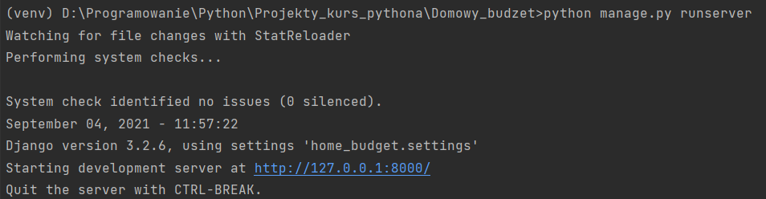
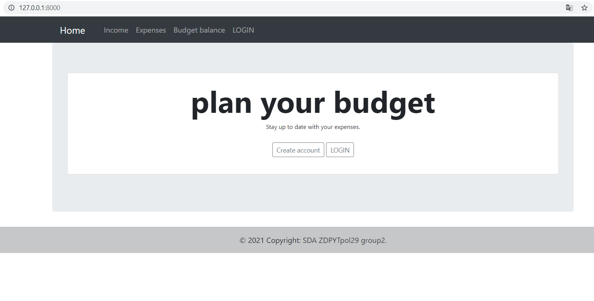
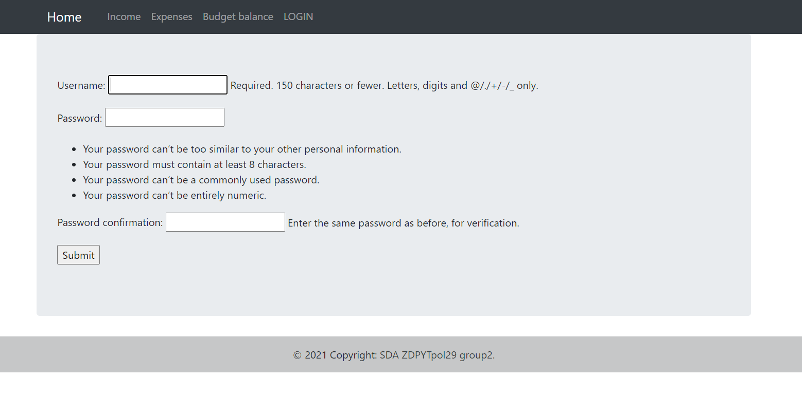
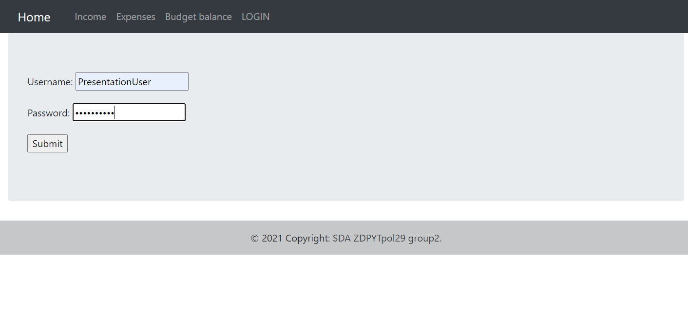
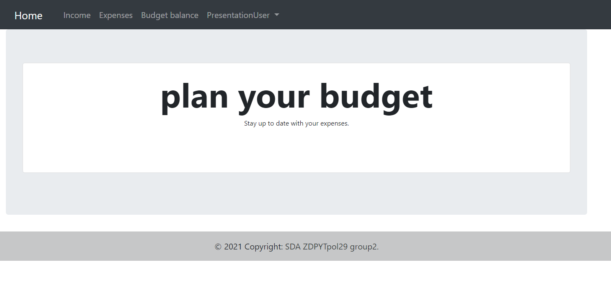
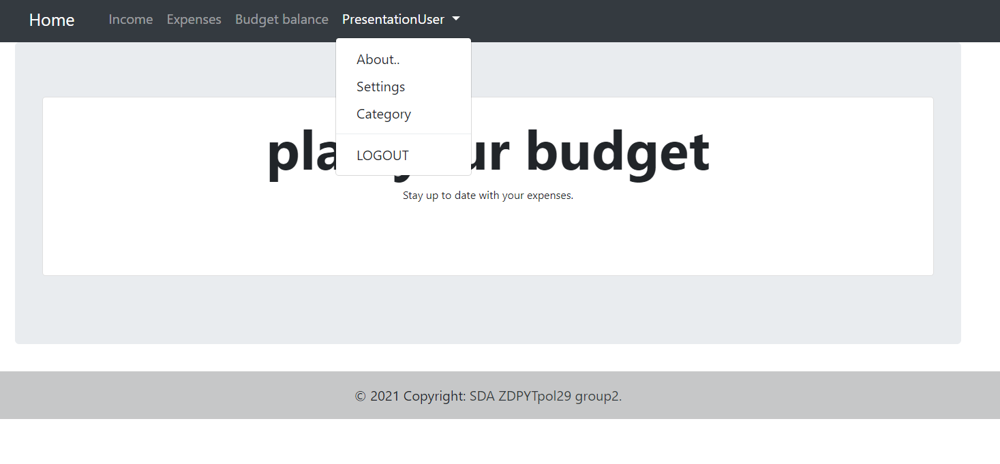
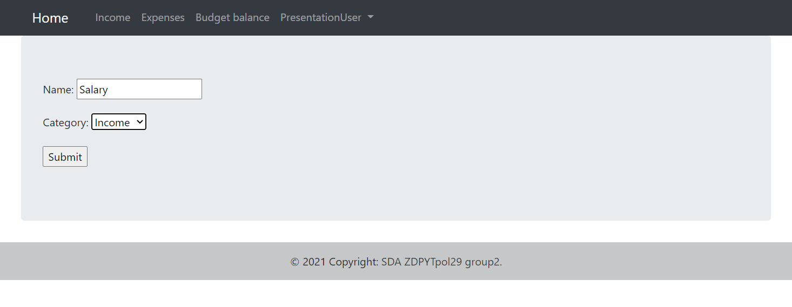
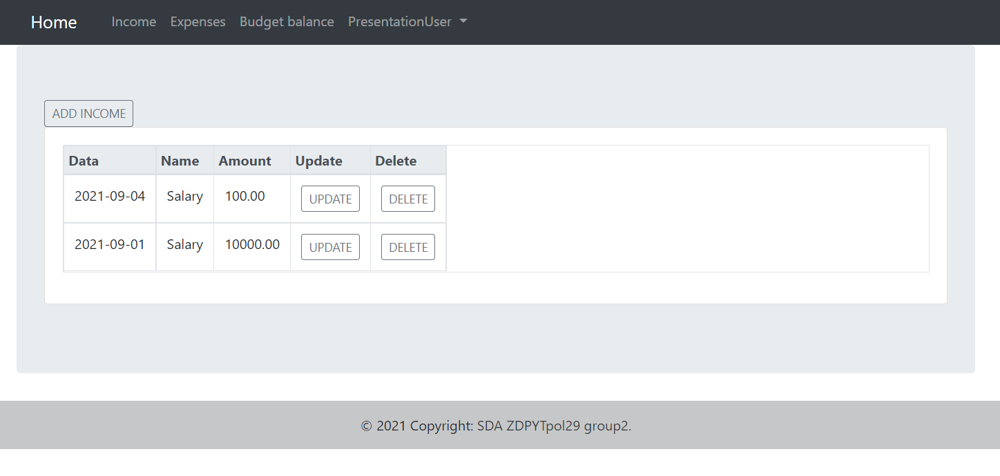
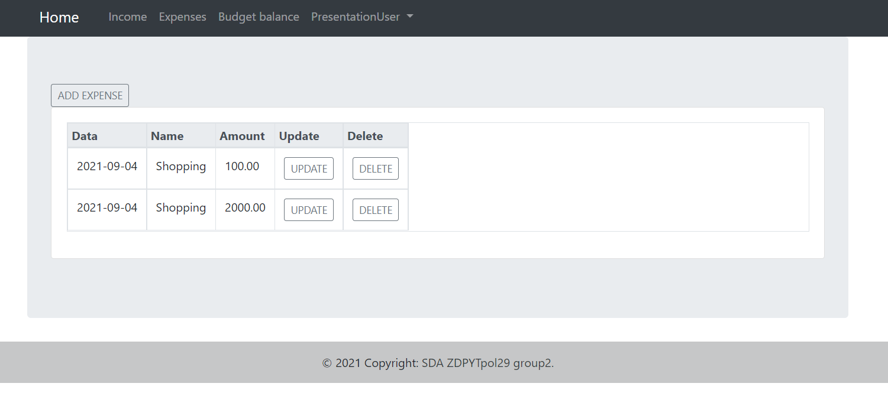
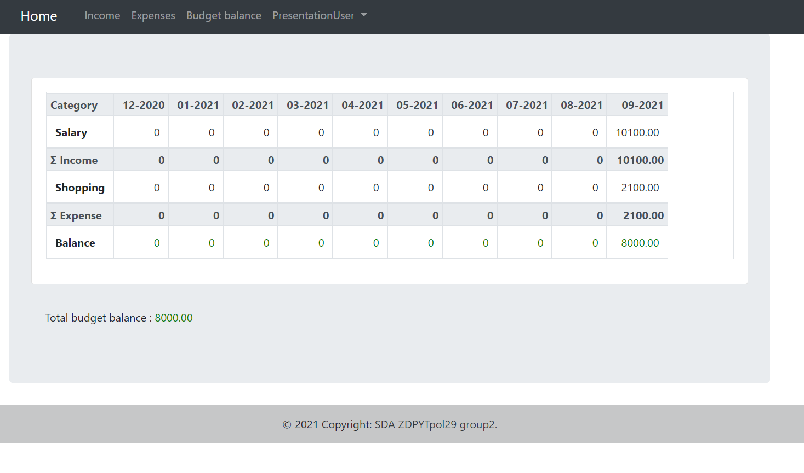

# Domowy_budzet is a budget calculator app which allows user to keep track of his/her expenses and incomes

## Set up
After cloning repository set up your own virtual environment

```bash
python -m venv path/to/virtual/env
```

Next activate your virtual environment by opening in your venv directory activate.bat file
```bash
your/venv/directory/Scripts/activate.bat
```

Then use the package manager [pip](https://pip.pypa.io/en/stable/) to install required libraries

```bash
pip install -r requirements.txt
```

After that migrate app models using

```bash
python manage.py migrate
```
To run the app use the command below and enter the link
```bash
python manage.py runserver
```
 
## Usage
####After you enter the link you will see the home page for an unauthenticated user

####To create your account click the *Create account* button
####You will see the register form

####Type in your username and password and click submit
####Then you can login with your new account, click on the login button either in the middle of your screen or on the bar at the top

####After you are logged in you will have access to the Income, Expenses and Budget balance tabs.

####You can also see that your username is now presented on the bar at the top, click on it to see more options and then choose the Category panel to add some categories

####Click on the add button and fill out the form with the category you want to use for your incomes and expenses and click submit

###When you have your categories set up you can start fully using this app
####Add your incomes or expenses under *Income* or *Expenses* tabs, positions that you add will be listed under these tabs and you will be able to update or delete them


#### you see your incomes and expenses aggregated under the *Budget balance* tab
